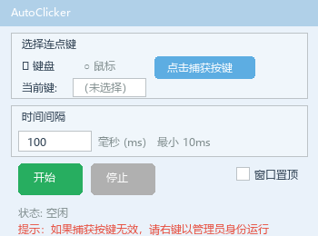

# AutoClicker

一个轻量级的 Windows 桌面连点器。支持键盘键和鼠标键的自动连点，可自定义时间间隔，后台运行不中断。

## 功能

- **键盘连点** — 捕获任意键盘键，自动重复点击
- **鼠标连点** — 支持左键、右键、中键、侧键 X1/X2
- **自定义间隔** — 最小 10ms，精确控制点击频率
- **后台运行** — 窗口最小化后依然正常工作
- **窗口置顶** — 可在其他窗口上方固定显示
- **即开即用** — 单 exe 文件，双击运行，无需安装环境

## 截图



## 使用方式

### 直接运行（推荐）

从 [Releases](../../releases) 下载 `AutoClicker.exe`，双击即可运行。

> 如果捕获按键功能无效，请右键 → 以管理员身份运行。

### 从源码运行

```bash
# 克隆仓库
git clone https://github.com/honggiaogiao/AutoClicker.git
cd AutoClicker

# 安装依赖
pip install -r requirements.txt

# 启动
python src/main.py
```

### 打包为 exe

```bash
pip install pyinstaller
pyinstaller AutoClicker.spec
```

## 技术栈

| 技术 | 用途 |
|------|------|
| Python 3 | 开发语言 |
| tkinter | GUI 界面 |
| keyboard | 键盘全局监听与控制 |
| mouse | 鼠标点击模拟 |
| PyInstaller | 打包为单 exe 文件 |

## 项目结构

```
AutoClicker/
├── src/
│   ├── main.py          # 程序入口
│   ├── gui.py           # 界面布局与交互
│   └── clicker.py       # 连点核心引擎
├── docs/                # 项目文档
│   ├── requirements.md  # 需求文档
│   ├── tech-stack.md    # 技术选型分析
│   ├── design.md        # 设计规范
│   └── roadmap.md       # 开发路线图
├── devlog/
│   └── devlog.md        # 开发日志
├── tests/
│   └── test_clicker.py  # 单元测试
├── CLAUDE.md            # AI 辅助开发指引
├── requirements.txt     # Python 依赖
└── README.md            # 本文件
```

## 为什么做这个项目

作为计算机科学与技术专业的学生，这是我第一个完整的桌面应用项目。通过它我实践了：

- 软件工程流程：需求分析 → 技术选型 → 阶段开发 → 测试 → 打包交付
- 多线程编程：线程安全的事件控制与优雅停止
- GUI 开发：使用 tkinter 构建交互界面
- AI 辅助开发：与 AI 协作，小步迭代，快速交付

## 许可

MIT
